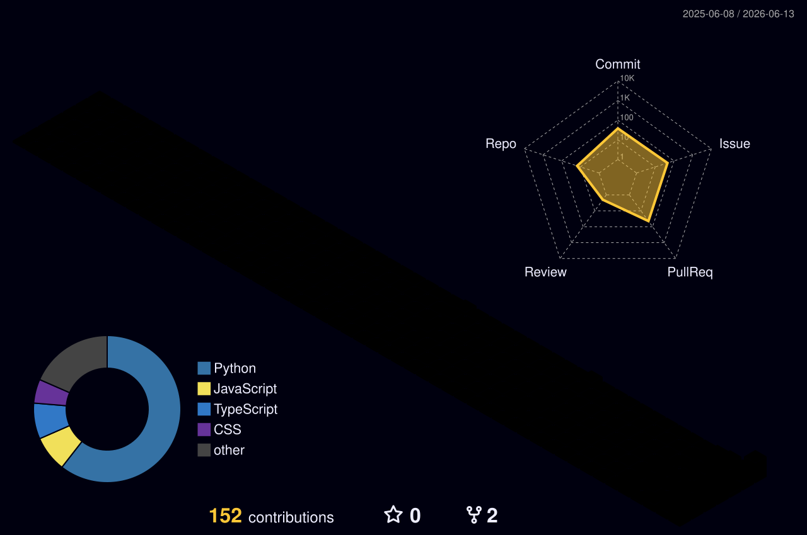

<div align="center">
  <!-- Typing Banner -->
  <a href="https://git.io/typing-svg">
    
  </a>
  
  <p align="center">
    <strong>"Building, debugging, and contributing—one commit at a time."</strong>
  </p>
  
  <!-- Social Badges -->
  <p align="center">
    <a href="https://linkedin.com/in/suyash-singh-4b616a324" target="_blank">
      
    </a>
    &nbsp;&nbsp;
    <a href="https://instagram.com/suyashhhh.s/" target="_blank">
      
    </a>
    &nbsp;&nbsp;
    <a href="https://github.com/ssuyashhhh" target="_blank">
      
    </a>
  </p>
  
  <!-- Visitor Counter -->
  <p align="center">
    
  </p>
</div>

---

### 💻 whoami --terminal

```bash
ssuyashhhh@github:~$ neofetch
 
  ███████╗██╗   ██╗██╗   ██╗ █████╗ ███████╗██╗  ██╗
  ██╔════╝██║   ██║╚██╗ ██╔╝██╔══██╗██╔════╝██║  ██║
  ███████╗██║   ██║ ╚████╔╝ ███████║███████╗███████║
  ╚════██║██║   ██║  ╚██╔╝  ██╔══██║╚════██║██╔══██║
  ███████║╚██████╔╝   ██║   ██║  ██║███████║██║  ██║
  ╚══════╝ ╚═════╝    ╚═╝   ╚═╝  ╚═╝╚══════╝╚═╝  ╚═╝
 
  -------------------------------------------------------------
  OS: India 🇮🇳
  Education: Integrated Degree (Bachelors + Masters) in Math & CS
  University: Birla Institute of Technology, Mesra
  Identity: Open Source Contributor | CP | Full Stack Developer
  Motto: "Building, debugging, and contributing—one commit at a time."
  -------------------------------------------------------------

ssuyashhhh@github:~$ whoami
Passionate developer who enjoys solving difficult problems, contributing to open source,
uncovering bugs, and creating software that makes a difference.

ssuyashhhh@github:~$ cat current_focus.json
{
  "active_work": [
    "Open Source Projects",
    "Competitive Programming",
    "Personal Projects",
    "Software Development",
    "Community Contributions"
  ]
}
```

---

## 👤 About Me

<table border="0">
  <tr>
    <td width="60%" valign="top">
      <p>I am a highly motivated student developer currently pursuing an <strong>Integrated Degree (Bachelors + Masters) in Mathematics and Computer Science</strong> at the <strong>Birla Institute of Technology, Mesra</strong>.</p>
      <p>My academic path bridges abstract mathematical logic with concrete computer science, equipping me with a unique analytical lens. I specialize in designing scalable full-stack web applications, debugging complex systems, and optimizing algorithm efficiency.</p>
      <p>I thrive in the intersection of theory and practice—taking rigorous mathematical principles and implementing them in clean, high-performance software solutions.</p>
    </td>
    <td width="40%" valign="top">
      <h4>⚡ Quick Facts</h4>
      <ul>
        <li>🎓 <b>Education:</b> Math & Computer Science (BS+MS)</li>
        <li>🌐 <b>Location:</b> India 🇮🇳</li>
        <li>🔍 <b>Interests:</b> Full Stack, CP, Open Source, Security</li>
        <li>🌱 <b>Philosophy:</b> Build securely, optimize deeply, share openly</li>
      </ul>
    </td>
  </tr>
</table>

---

## 🛠️ Tech Arsenal

<div align="center">
  <table>
    <tr>
      <td align="center"><b>Languages</b></td>
      <td>
        
      </td>
    </tr>
    <tr>
      <td align="center"><b>Frontend</b></td>
      <td>
        
      </td>
    </tr>
    <tr>
      <td align="center"><b>Backend</b></td>
      <td>
        
      </td>
    </tr>
    <tr>
      <td align="center"><b>Tools</b></td>
      <td>
        
        
      </td>
    </tr>
  </table>
</div>

---

## 🚀 My Journey

<table border="0">
  <tr>
    <td width="50%" valign="top">
      <h3>🌐 Open Source & Security</h3>
      <p>A firm believer in community-driven, transparent software. My focus is on:</p>
      <ul>
        <li><b>Bug Hunting:</b> Deep-diving into codebases to find edge cases, performance bottlenecks, and security vulnerabilities.</li>
        <li><b>Sustainable Contributions:</b> Submitting clean, well-tested PRs that improve the maintenance score of core utilities.</li>
        <li><b>Community Support:</b> Helping shape tools that thousands of developers use daily.</li>
      </ul>
    </td>
    <td width="50%" valign="top">
      <h3>🏆 Competitive Programming</h3>
      <p>Solving complex challenges under strict time and resource constraints. I focus on:</p>
      <ul>
        <li><b>Algorithmic Thinking:</b> Structuring solutions using graph theory, combinatorics, number theory, and advanced dynamic programming.</li>
        <li><b>C++ Mastery:</b> Leveraging modern C++ concepts for high-performance execution.</li>
        <li><b>Problem Solving:</b> Treating code optimization as a science, keeping runtime and memory footprints to the bare minimum.</li>
      </ul>
    </td>
  </tr>
</table>

---

## 🏆 Achievements & Milestones

<table border="0">
  <tr>
    <td width="33%" valign="top" align="center">
      <h3>🐙</h3>
      <h4>Open Source Impact</h4>
      <p>Uncovering critical bugs and contributing high-quality pull requests to community projects.</p>
    </td>
    <td width="33%" valign="top" align="center">
      <h3>🧠</h3>
      <h4>Algorithmic Excellence</h4>
      <p>Developing optimal solutions for complex mathematical and logic-based problems.</p>
    </td>
    <td width="33%" valign="top" align="center">
      <h3>📚</h3>
      <h4>Continuous Learning</h4>
      <p>Applying mathematics and computer science theory directly to real-world software architecture.</p>
    </td>
  </tr>
</table>

---

## 📊 GitHub Analytics

<div align="center">
  <table border="0">
    <tr>
      <td align="center" width="50%">
        
      </td>
      <td align="center" width="50%">
        
      </td>
    </tr>
  </table>
  
  <br/>
  
  
  
  <br/><br/>
  
  
</div>

---

## 🎨 Contribution Showcase

<table border="0">
  <tr>
    <td align="center" width="50%" valign="top">
      <h4>👾 Contribution Snake</h4>
      
    </td>
    <td align="center" width="50%" valign="top">
      <h4>📊 3D Contribution Space</h4>
      
    </td>
  </tr>
</table>

---

<div align="center">
  <h3>🤝 Connect & Collaborate</h3>
  
  <a href="https://linkedin.com/in/suyash-singh-4b616a324" target="_blank">
    
  </a>
  &nbsp;&nbsp;
  <a href="https://instagram.com/suyashhhh.s/" target="_blank">
    
  </a>
  &nbsp;&nbsp;
  <a href="https://github.com/ssuyashhhh" target="_blank">
    
  </a>

  <br/><br/>

  <p><i>"Building, debugging, and contributing—one commit at a time."</i></p>
</div>
